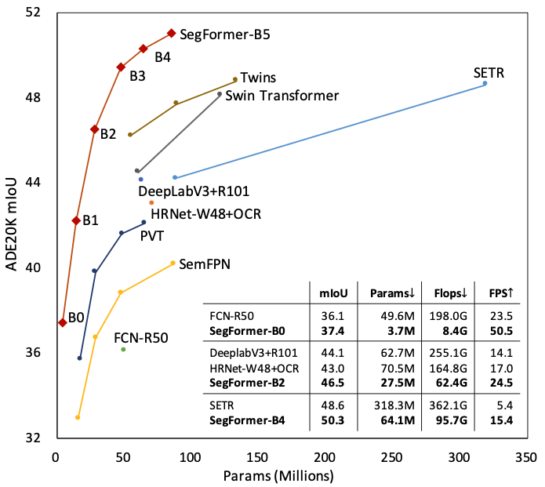

[](https://github.com/NVlabs/SegFormer/blob/master/LICENSE)


# SegFormer: Simple and Efficient Design for Semantic Segmentation with Transformers

<!--  -->
<div align="center">
  
</div>
<p align="center">
  Figure 1: Performance of SegFormer-B0 to SegFormer-B5.
</p>

### [Project page](https://github.com/NVlabs/SegFormer) | [Paper](https://arxiv.org/abs/2105.15203) | [Demo (Youtube)](https://www.youtube.com/watch?v=J0MoRQzZe8U) | [Demo (Bilibili)](https://www.bilibili.com/video/BV1MV41147Ko/)

SegFormer: Simple and Efficient Design for Semantic Segmentation with Transformers.<br>
[Enze Xie](https://xieenze.github.io/), [Wenhai Wang](https://whai362.github.io/), [Zhiding Yu](https://chrisding.github.io/), [Anima Anandkumar](http://tensorlab.cms.caltech.edu/users/anima/), [Jose M. Alvarez](https://rsu.data61.csiro.au/people/jalvarez/), and [Ping Luo](http://luoping.me/).<br>
NeurIPS 2021.

This repository contains the official Pytorch implementation of training & evaluation code and the pretrained models for [SegFormer](https://arxiv.org/abs/2105.15203).

SegFormer is a simple, efficient and powerful semantic segmentation method, as shown in Figure 1.

We use [MMSegmentation v0.13.0](https://github.com/open-mmlab/mmsegmentation/tree/v0.13.0) as the codebase.

🔥🔥 SegFormer is on [MMSegmentation](https://github.com/open-mmlab/mmsegmentation/tree/master/configs/segformer). 🔥🔥 


## Installation

For install and data preparation, please refer to the guidelines in [MMSegmentation v0.13.0](https://github.com/open-mmlab/mmsegmentation/tree/v0.13.0).

Other requirements:
```pip install timm==0.3.2```

An example (works for me): ```CUDA 10.1``` and  ```pytorch 1.7.1``` 

```
pip install torchvision==0.8.2
pip install timm==0.3.2
pip install mmcv-full==1.2.7
pip install opencv-python==4.5.1.48
cd SegFormer && pip install -e . --user
```

## Evaluation

Download `trained weights`. 
(
[google drive](https://drive.google.com/drive/folders/1GAku0G0iR9DsBxCbfENWMJ27c5lYUeQA?usp=sharing) | 
[onedrive](https://connecthkuhk-my.sharepoint.com/:f:/g/personal/xieenze_connect_hku_hk/Ept_oetyUGFCsZTKiL_90kUBy5jmPV65O5rJInsnRCDWJQ?e=CvGohw)
)

Example: evaluate ```SegFormer-B1``` on ```ADE20K```:

```
# Single-gpu testing
python tools/test.py local_configs/segformer/B1/segformer.b1.512x512.ade.160k.py /path/to/checkpoint_file

# Multi-gpu testing
./tools/dist_test.sh local_configs/segformer/B1/segformer.b1.512x512.ade.160k.py /path/to/checkpoint_file <GPU_NUM>

# Multi-gpu, multi-scale testing
tools/dist_test.sh local_configs/segformer/B1/segformer.b1.512x512.ade.160k.py /path/to/checkpoint_file <GPU_NUM> --aug-test
```

## Training

Download `weights` 
(
[google drive](https://drive.google.com/drive/folders/1b7bwrInTW4VLEm27YawHOAMSMikga2Ia?usp=sharing) | 
[onedrive](https://connecthkuhk-my.sharepoint.com/:f:/g/personal/xieenze_connect_hku_hk/EvOn3l1WyM5JpnMQFSEO5b8B7vrHw9kDaJGII-3N9KNhrg?e=cpydzZ)
) 
pretrained on ImageNet-1K, and put them in a folder ```pretrained/```.

Example: train ```SegFormer-B1``` on ```ADE20K```:

```
# Single-gpu training
python tools/train.py local_configs/segformer/B1/segformer.b1.512x512.ade.160k.py 

# Multi-gpu training
./tools/dist_train.sh local_configs/segformer/B1/segformer.b1.512x512.ade.160k.py <GPU_NUM>
```

## Visualize

Here is a demo script to test a single image. More details refer to [MMSegmentation's Doc](https://mmsegmentation.readthedocs.io/en/latest/get_started.html).

```shell
python demo/image_demo.py ${IMAGE_FILE} ${CONFIG_FILE} ${CHECKPOINT_FILE} [--device ${DEVICE_NAME}] [--palette-thr ${PALETTE}]
```

Example: visualize ```SegFormer-B1``` on ```CityScapes```: 

```shell
python demo/image_demo.py demo/demo.png local_configs/segformer/B1/segformer.b1.512x512.ade.160k.py \
/path/to/checkpoint_file --device cuda:0 --palette cityscapes
```


## License
Please check the LICENSE file. SegFormer may be used non-commercially, meaning for research or 
evaluation purposes only. For business inquiries, please visit our website and submit the form: [NVIDIA Research Licensing](https://www.nvidia.com/en-us/research/inquiries/).


## Citation
```
@inproceedings{xie2021segformer,
  title={SegFormer: Simple and Efficient Design for Semantic Segmentation with Transformers},
  author={Xie, Enze and Wang, Wenhai and Yu, Zhiding and Anandkumar, Anima and Alvarez, Jose M and Luo, Ping},
  booktitle={Neural Information Processing Systems (NeurIPS)},
  year={2021}
}
```
